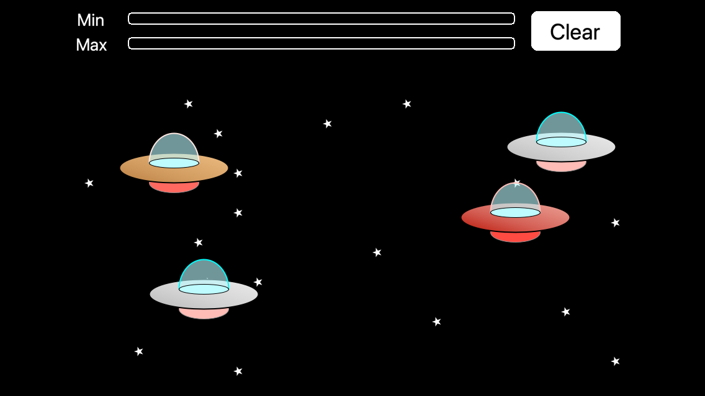
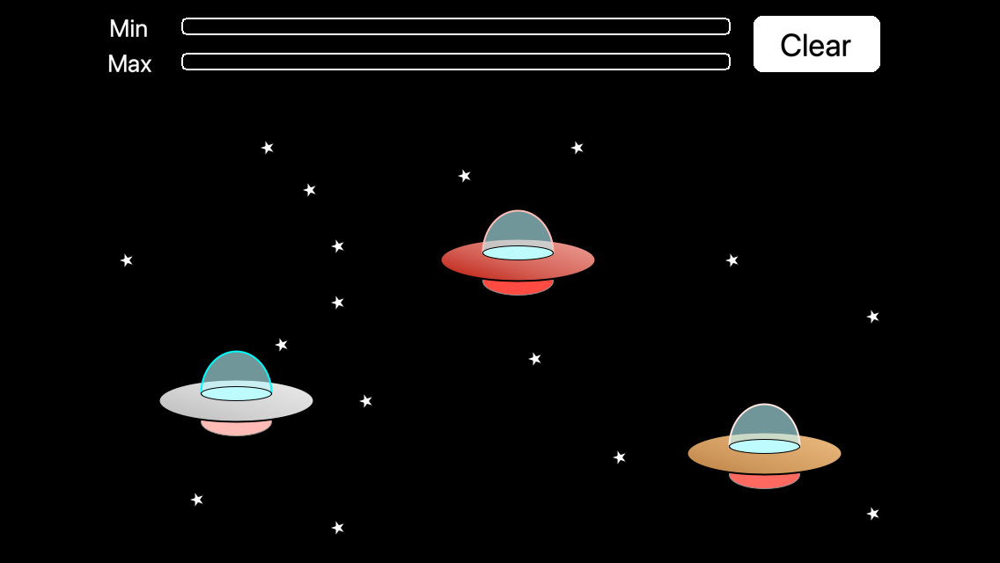

# Examples

Each folder is a complete Solar2D project with its own copy of the library: open its `main.lua` in the Solar2D Simulator. Both are the same app: tap the background to add a UFO, drag a UFO to move it, tap a UFO to change its color (cool, warm, hot), and press **Clear** to remove them all. Every change is saved; relaunch the app and the UFOs are back where you left them. The two bars at the top show AutoStore's `TIMER_MIN` and `TIMER_MAX` timers counting down to the next save, and "Data Saved !!" appears when it happens.

Each UFO is a [dmc-objects](https://github.com/dmccuskey/dmc-objects) class that is given its own branch of the data ([Objects with Their Own Branch](../docs/using-autostore.md#objects-with-their-own-branch)); AutoStore doesn't need dmc-objects.

| | |
|---|---|
|  | **DMC-autostore-basic**: the app as described above. `main.lua` sets up the data on the first launch, creates a UFO for each saved entry, and adds and removes entries; `component/ufo.lua` changes its own entry. |
|  | **DMC-autostore-plugins**: the same app with a plugin, `dmc_autostore_plugins.lua`, which stores the data file as base64 ([Plugins](../docs/using-autostore.md#plugins)). The console shows `AutoStore Plugin: encoding data` at each save. |
